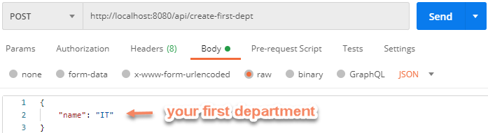
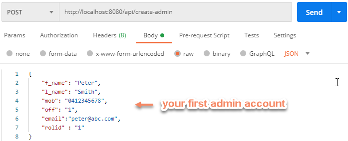

# Ez Portal
* [Description](#description)
* [Installation](#installation)
* [Usage](#usage)
* [License](#license)
* [Contributing](#contributing)
* [Tests](#tests)
* [Questions](#questions)
## Description
Ez-Portal is a HR management system, that uses a wide-range of technologies on both front-end (HTML,JS,CSS, Bootstrap, ChartJS) and back-end (MySQL,Sequelize, NodeJS, Express JS,Handlebars,Jason Web Tokens)
## Installation
1. Make sure Node.js is installed
	>  Node.js
	>  MySQL Workbench
	>  Postman
2. Clone this repository
3. Run the following code at terminal to install package
	>  npm install
4. Create an .env file with the following content
	> DB_USER=username      <--- your own MySQL username
	> DB_PASS=password      <--- your own MySQL password
	> JWT_SECRET=GroupXYZ
	> PORT=8080         

## Usage
1. Run the following code at MySQL workbench to create database
	>  drop database if exists employee_demo_db;
	>  create database employee_demo_db;
	>  use employee_demo_db;
2. Use Postman to create first department

3. Use Postman to create first role

4. Use Postman to create first admin account.

5. Run the following code to start the app
	>  node server.js
6. Type the following address on your browser to start using the app
	>  http://localhost:8080/

## Demo
Click on the pic to see the demo video

## Contributing
Please submit a **Pull request** if you would like to contribute to the project

## Tests

## Questions
You are welcome to provide any feedback and/or ask questions.
Please, send any question to:
1. Tony Melek[tonymelek.au@gmail.com](mailto:tonymelek.au@gmail.com)
2. Christopher
3. Alan Chang[pichengchang@gmail.com](mailto:pichengchang@gmail.com)
4. Daniel Zhang

## License
The project is protected under MIT,you may need to read through license conditions
